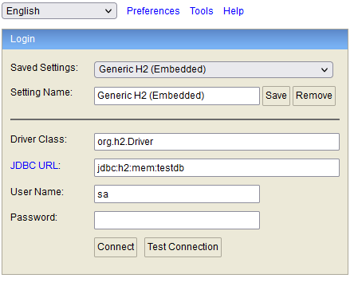
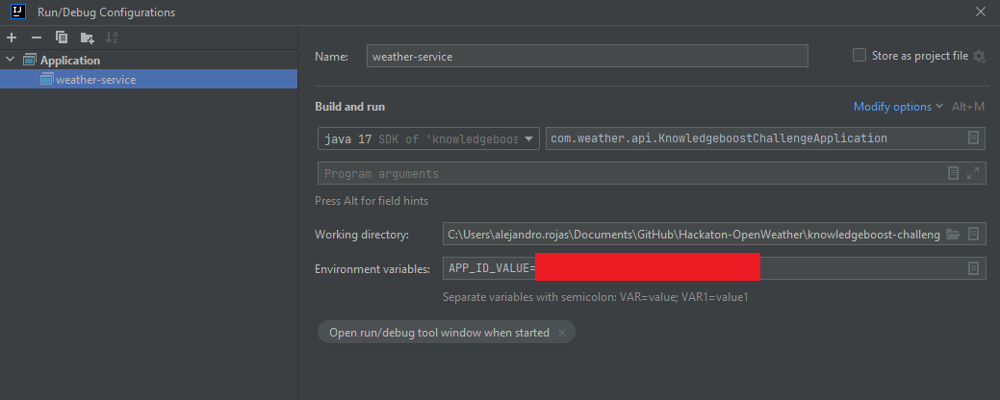

# knowledgeboost-challenge
Repository for Final Code Challenge

## Description

This project calls the Open Weather API and returns the weather by city name or by latitude and longitude.

## Technologies

* Lombok
* Spring framework 3.0.2
* Open Weather API v2.5
* Java v17

## Use
You must call the service in the port 8091 with two options.

* **By city name ->** _http://localhost:8091/weather/city/{CityName}_
* **By latitude and longitude ->** _http://localhost:8091/weather/latitude/{lat}/longitude/{lon}_

In order to open the H2 console ->  _http://localhost:8091/h2-console_

## Prerequisites

You must define the Environment variable named as "APP_ID_VALUE" with a valid API key for Open Weather API.

## Developer

Alejandro Rojas (alejandro.rojas@globant.com)
