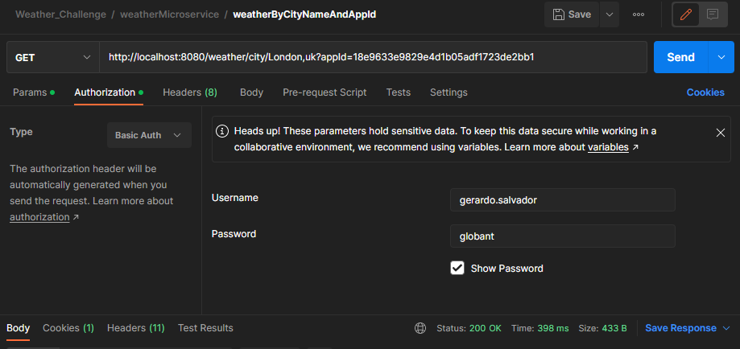

# knowledgeboost-challenge
Repository for Final Code Challenge

## Uses
###This microservices was coding to learn and practice the BackEnd skills:
* 'Spring boot' 
* 'Junit'
* 'Mockito'
* 'Docker' and 'Docker-compose'
* 'Basic auth'
* 'NoSQL' connection with 'MongoBD'
* 'Swagger' with 'Open Api'
* The best practices of 'java'
* The use of 'github'
* Learn how consulting the 'open weather' server with 'Rest template'
* 

## Technologies
***
A list of technologies used within the project:

* [Spring Boot](https://spring.io/projects/spring-boot): Version 3.0.2
* [mongodb](https://www.mongodb.com/)
* [RestTemplate](https://docs.spring.io/spring-framework/docs/current/javadoc-api/org/springframework/web/client/RestTemplate.html)
* [Swagger-Open API](https://springdoc.org/v2/): Version 2.0.2
* [Java](https://www.oracle.com/java/technologies/javase/jdk18-archive-downloads.html) : Version 17
* [Open Weather API](https://home.openweathermap.org) : Version v2.5
* [Docker](https://www.docker.com/) 
* [lombok](https://projectlombok.org/) 
* [Junit](https://junit.org/junit5/docs/current/user-guide/) : Version 5
* [gson](https://sites.google.com/site/gson/gson-user-guide) : Version 2.10.1


## Tools
***
A list of Tools used within the project:
* [Mongo Compass](https://www.mongodb.com/products/compass): Version 1.32.2
* [IntelliJ IDEA](https://blog.jetbrains.com/idea/2021/09/intellij-idea-2021-2-2/): Version 2021.2.2(community edition)
* [Docker](https://www.docker.com/)
* [Dockerhub](https://hub.docker.com/)


## Configurations
* Service name        ==>  weather-service
* Service version     ==>  0.0.1
* Service port        ==>  8080
* database connexion  ==>  mongodb://127.0.0.1:27017/weather_db
* external server     ==>  http://api.openweathermap.org/data/2.5/weather


If everything works fine there should be a Docker container up and running exposing the service. To access it head to:

http://localhost:8081/tournament-core/swagger-ui/


## How consulting the endpoints 
#### Contains two endpoints

Add the next URL in postman with GET 

*weatherByCityNameAndAppId =>               http://localhost:8080/weather/city/London,uk?appId=18e9633e9829e4d1b05adf1723de2bb2
*weatherByLatitudeAndLongitudeAndAppId=>    http://localhost:8080/weather/latitude/19.3584097/longitude/-99.0608733

### Logging HttpSecurity Basic Auth
add user and password in postman


### docker  commands

Clone this project and head to `Knowlengeboost-challenge` folder and execute the following commands.

*This information is to generate image and runs the container with Dockerfile
```sh
mvn clean install
docker network create challenge
docker docker build -t weather . -f .\Dockerfile
docker run -p 8080:8080 -d --rm --name weather-service --network challenge weather
docker logs weather-service 
```
### docker-compose commands
*This information is to generate image and runs the container with Docker-Compose
```sh

mvn clean install
docker-compose up -d
docker-compose down
```

## Contact
* Developed by Gerardo Salvador Bermudez(gerardo.salvador@globant.com)


*********************************************************************************************************
 _    _               _    _                   _____  _             _  _
| |  | |             | |  | |                 /  __ \| |           | || |
| |  | |  ___   __ _ | |_ | |__    ___  _ __  | /  \/| |__    __ _ | || |  ___  _ __    __ _   ___
| |/\| | / _ \ / _` || __|| '_ \  / _ \| '__| | |    | '_ \  / _` || || | / _ \| '_ \  / _` | / _ \
\  /\  /|  __/| (_| || |_ | | | ||  __/| |    | \__/\| | | || (_| || || ||  __/| | | || (_| ||  __/
 \/  \/  \___| \__,_| \__||_| |_| \___||_|     \____/|_| |_| \__,_||_||_| \___||_| |_| \__, | \___|
                                                                                        __/ |
                                                                                        |___/
*********************************************************************************************************
                                                                                              